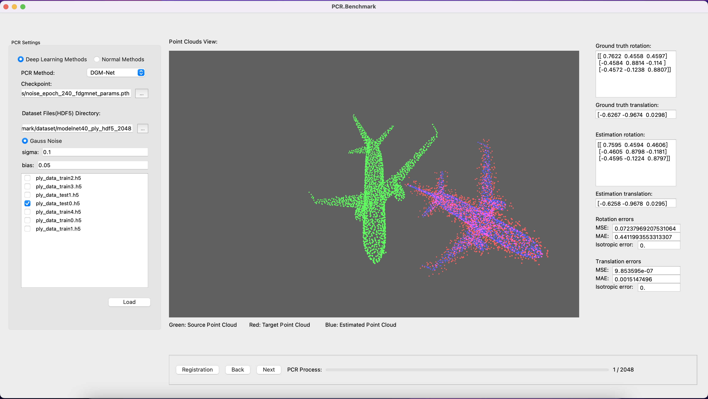

# A Point Cloud Registration Benchmark


## Introduction

To facilitate the test of the registration performance of each point cloud registration baseline, a point cloud registration benchmark GUI based on **PyQt5** is developed.




## Point Cloud Registration Baselines Currently Supported

- [x] ICP
- [x] GMM
- [x] FGR
- [x] DGM
- [x] DGM-Net
- [ ] [RPM-Net](https://github.com/yewzijian/RPMNet)
- [ ] [RGM](https://github.com/fukexue/RGM)
- [x] [PCRNet](https://github.com/zhulf0804/PCReg.PyTorch)


## Data Simulation
Point cloud data `modelnet40_ply_hdf5_2048` from ModelNet40 are given here.

### Clean Data

You can select point cloud data files (*.hdf5/h5), which contain point clouds in the format `Point-Cloud-Num x Point-Num x 3`. Random rotation matrix and translation vector will be generated with the angles in $[-45\degree,45\degree]$  and translation in $[-1,1]$ of XYZ axis.

### Noise Data

You can add gauss noise into the target point cloud datas with bias in XYZ axis for registration tests.


## Requirements

Python3.7 is highly recommended for the compatibility of Open3D. And requirements are listed as follows:

* h5py==3.8.0
* matplotlib==3.5.3
* numpy==1.21.6
* open3d==0.16.1
* PyQt5==5.15.9
* pyqtgraph==0.12.4
* scipy==1.7.3
* torch==1.13.1

To configure the environment, simply enter this command: 

```shell
pip3 install -r requirements.txt
```


## Run

You can run the PCR.Benchmark with the command: 

```shell
python3 ./src/benchmark.py
```